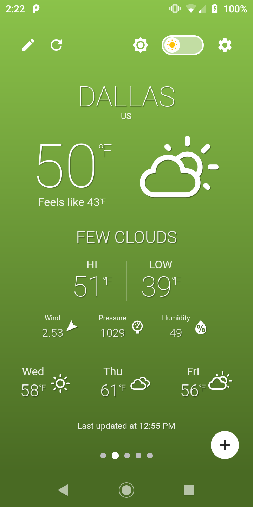
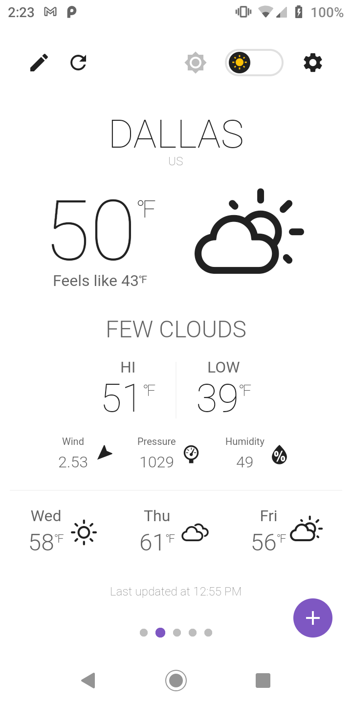
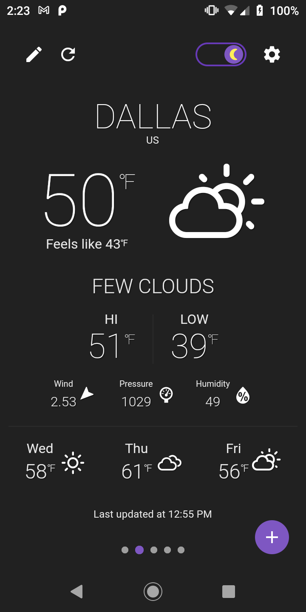

<p align="center">
  
</p>

<h1 align="center">Flutter Weather</h1>
<p align="center">A beautiful weather forecasting application built with the <a href="https://www.flutter.dev/" target="_blank">Flutter development kit</a>.</p>

<p align="center">
<a href="https://play.google.com/store/apps/details?id=io.flutter_weather.prod" target="_blank"></a>&nbsp;&nbsp;&nbsp;<a href="https://apps.apple.com/us/app/my-flutter-weather/id1550322379" target="_blank"></a>
</p>

<h2 align="center">Screenshots</h2>
<table cellspacing="0" style="width:100%">
  <tbody>
    <tr>
      <td style="text-align:right"></td>
      <td style="text-align:center"></td>
      <td style="text-align:left"></td>
    </tr>
  </tbody>
</table>

## Environment Configuration
You will need to create a file called **env_config.dart** in the **lib** folder with the following:

```dart
class EnvConfig {
  static const String OPENWEATHERMAP_API_KEY = '<your_openweather_api_key>';
  static const String OPENWEATHERMAP_API_URI = 'api.openweathermap.org';
  static const String OPENWEATHERMAP_API_DAILY_PATH = '/data/2.5/forecast/daily';
  static const int REFRESH_TIMEOUT_MINS = 5;
  static const String DEFAULT_COUNTRY_CODE = 'us';
  static const String SUPPORTED_LOCALES = 'en';
  static const String PRIVACY_POLICY_URL = '<your_privacy_policy_url>';
  static const String GITHUB_URL = '<your_github_url>';
  static const String SENTRY_DSN = '<your_sentry_dsn_or_null>';
}
```

## Android Configuration

Create a file called **local.properties** in the **android** folder with the following:
```bash
sdk.dir=<path_to_android_sdk>
flutter.sdk=<path_to_flutter_sdk>
flutter.appLabel=Flutter Weather
flutter.buildMode=<debug|profile|release>
flutter.versionName=1.0.0
```

Create a file called **key.properties** in the **android** folder with the following:
```bash
storePassword=
keyPassword=
keyAlias=
storeFile=
```

## Firebase Configuration

This application uses <a href="https://firebase.google.com/" target="_blank">Firebase</a> for web hosting, app distribution and remote configuration. You will need to create your own account and copy your Firebase configuration into the following folder(s):

**Android**:
```bash
android/app/google-services.json
```

**iOS**:
```bash
ios/Runner/GoogleService-Info.plist
```

You can find this file in your Firebase console in *Project Settings -> Your apps -> SDK setup and configuration*.

## Run Application (Nx)
This project uses <a href="https://nx.dev" target="_blank">Nx</a>. Go [here](https://nx.dev/latest/angular/getting-started/cli-overview) for installation instructions.

**DEV**
```bash
nx run mobile_flutter:runDev
```

**PROD**
```bash
nx run mobile_flutter:runProd
```

## Run Application (Docker)

**DEV**
```bash
docker-compose up flutter_weather_dev
```

**PROD**
```bash
docker-compose up flutter_weather_prod
```

## Build Android
**APK**
```bash
nx run mobile_flutter:buildApk
```

**Appbundle**
```bash
nx run mobile_flutter:buildAppbundle
```

## Build iOS
```bash
nx run mobile_flutter:buildIos
```

## Build launcher icons

```bash
nx run mobile_flutter:buildLauncherIcons
```

## Build splash screens

```bash
nx run mobile_flutter:buildSplashScreens
```

## Credits
Created by [@scarnett](https://github.com/scarnett/)

## License
[](https://opensource.org/licenses/MIT)  
Copyright &copy; 2021 Scott Carnett. Licensed under the MIT License (MIT)
